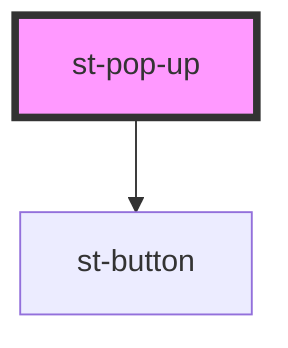

# st-pop-up

<!-- Auto Generated Below -->

## Properties

| Property   | Attribute  | Description | Type     | Default     |
| ---------- | ---------- | ----------- | -------- | ----------- |
| `headline` | `headline` |             | `string` | `undefined` |
| `message`  | `message`  |             | `string` | `undefined` |

## Events

| Event        | Description | Type                   |
| ------------ | ----------- | ---------------------- |
| `popUpClose` |             | `CustomEvent<boolean>` |

## Methods

### `hide() => Promise<void>`

#### Returns

Type: `Promise<void>`

### `show() => Promise<void>`

#### Returns

Type: `Promise<void>`

## Dependencies

### Depends on

- [st-button](../st-button)

### Graph

----------------------------------------------

*Built with [StencilJS](https://stenciljs.com/)*
